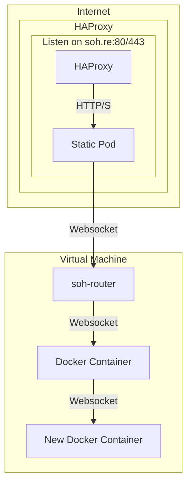

# soh-router

The `soh-router` is a golang binary designed for routing websocket traffic to docker containers. It facilitates the creation and cleanup of docker containers as needed to handle incoming traffic.

This software serves as the primary infrastructure for [soh.re](https://soh.re), a website for displaying Jonathan Mainguy's open source profile as a terminal application.

## Installation

To install the `soh-router` using a deb or rpm from the [releases page](https://github.com/jmainguy/soh-router/releases), follow these steps:

1. Download the appropriate package for your system (e.g. `soh-router_1.0.7_amd64.deb` or `soh-router-1.0.7-1.x86_64.rpm`).
2. Install the package (e.g. `sudo dpkg -i soh-router_1.0.7_amd64.deb` or `sudo rpm -i soh-router-1.0.7-1.x86_64.rpm`).
3. The binary will be installed to `/usr/bin/soh-router`.
4. You can start the service with `sudo systemctl start soh-router`.
5. You can enable the service to start on boot with `sudo systemctl enable soh-router` .

## Usage

Explanation:

1. The internet traffic comes in and reaches the HAProxy.
2. HAProxy listens on the domain soh.re on ports 80 and 443.
3. HAProxy forwards HTTP/S traffic to a static pod.
4. The static pod's job is to upgrade HTTP/S connections to websockets.
5. Once the HAProxy receives a websocket connection, it forwards it to a virtual machine (VM) where soh-router is running.
6. The soh-router on the VM forwards the websocket connection to a Docker container running the soh.re website code.
7. The Docker container processes the websocket connection and serves the content to end user
8. Additionally, soh-router spins up a new Docker container in the background to handle new connections for the next user, as this container is now not accepting new traffic.

Each connection is unique to a container, so new connections get a new container.

